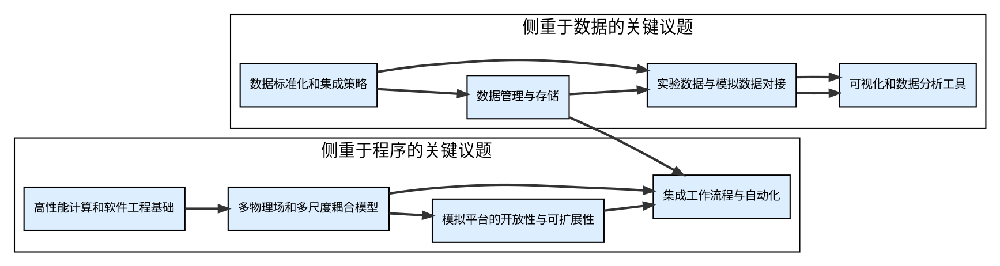

# Welcome to MkDocs

For full documentation visit [mkdocs.org](https://www.mkdocs.org).

## Commands

* `mkdocs new [dir-name]` - Create a new project.
* `mkdocs serve` - Start the live-reloading docs server.
* `mkdocs build` - Build the documentation site.
* `mkdocs -h` - Print help message and exit.

## Project layout

    mkdocs.yml    # The configuration file.
    docs/
        index.md  # The documentation homepage.
        ...       # Other markdown pages, images and other files.


```dot
digraph FusionSimulationDataPlatform {
    rankdir=TB;
    node [shape=rectangle, style=filled, fillcolor="#EFEFEF", fontsize=10];

    // 数据源节点
    ExperimentalData [label="实验数据"];
    SimulationData [label="模拟数据"];

    // 数据整合与标准化
    DataIntegration [label="数据整合与标准化"];

    // 工作流程引擎
    WorkflowEngine [label="工作流程引擎", shape=diamond];

    // 集成模拟环境
    IntegratedSimulator [label="集成模拟环境"];

    // 可视化与分析工具
    VisualizationAnalysis [label="可视化与分析工具"];

    // 数据存储与共享
    DataRepository [label="数据存储与共享"];

    // 连接各节点
    ExperimentalData -> DataIntegration;
    SimulationData -> DataIntegration;
    DataIntegration -> WorkflowEngine;
    WorkflowEngine -> IntegratedSimulator;
    IntegratedSimulator -> VisualizationAnalysis;
    VisualizationAnalysis -> DataRepository;


    // 高性能计算接口
    HPCInterface [label="高性能计算接口", shape=parallelogram];
    SimulationData -> HPCInterface -> IntegratedSimulator;

    // 数据验证与不确定性量化
    ValidationUQ [label="数据验证与不确定性量化", shape=ellipse];
    WorkflowEngine -> ValidationUQ -> DataRepository;
}

// 设置分组，让可视化效果更清晰
{ rank=same; ExperimentalData; SimulationData }
{ rank=same; DataIntegration; WorkflowEngine }
{ rank=same; IntegratedSimulator; VisualizationAnalysis }
{ rank=same; EdgePlasmaAnalysis; HPCInterface; ValidationUQ }
{ rank=same; DataRepository }

// 添加注解说明
edge [style=invis];
ExperimentalData -> { rank=same; DataIntegration } [label="实验数据整合"];
SimulationData -> { rank=same; DataIntegration } [label="模拟数据整合"];
HPCInterface -> IntegratedSimulator [label="高性能计算支持"];
ValidationUQ -> DataRepository [label="验证与不确定性量化结果"];
}
```
